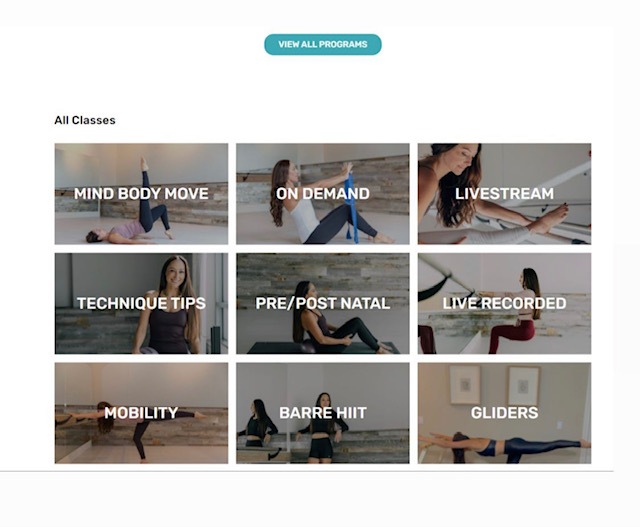

# Arketa Pair Programming

### `npm start`

Runs the app in the development mode.\
Open [http://localhost:3000](http://localhost:3000) to view it in the browser.

The page will reload if you make edits.\
You will also see any lint errors in the console.

## Project

The goal of this project is to build a page for an on demand library like below.

## Steps to success

1) Create a new route `/library` with a button to link to a new page
2) Load the on-demand classes from a an API endpoint (see below)
3) On this new "Library" page create a collection of images (of your choice or using something from the api response) for each video category
4) Clicking on each category should lead you to another route `/library/:category_id` with a collection of videos for this particular category
5) Create a pull request to the main branch when you're done!

Notes: feel free to import up to 3 node packages to assist with development

### BONUS:
* +1 for design creativity
* Click on a video to play an html5 video component in browser
* Make this embeddable inside an iframe i.e. dynamically changes height of iframe based on its content

# API

`https://app.arketa.co/api/widget/vod/M58cY5iP41ZmBo0x5ejW588787N2`

Response
* See types in src/types.ts
